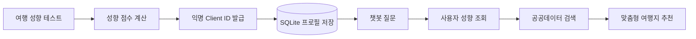
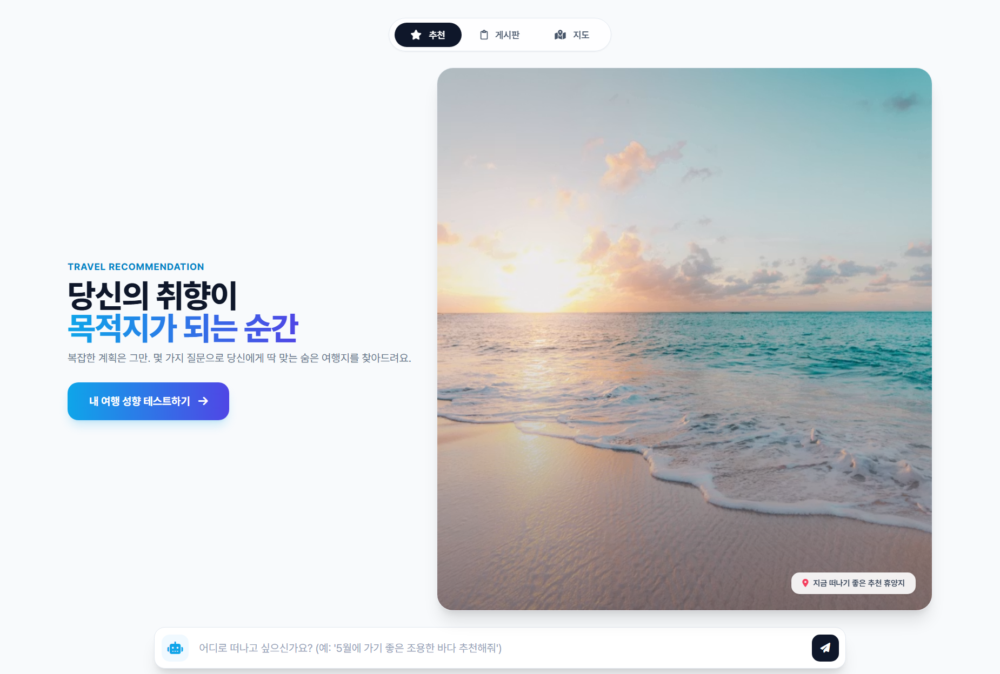
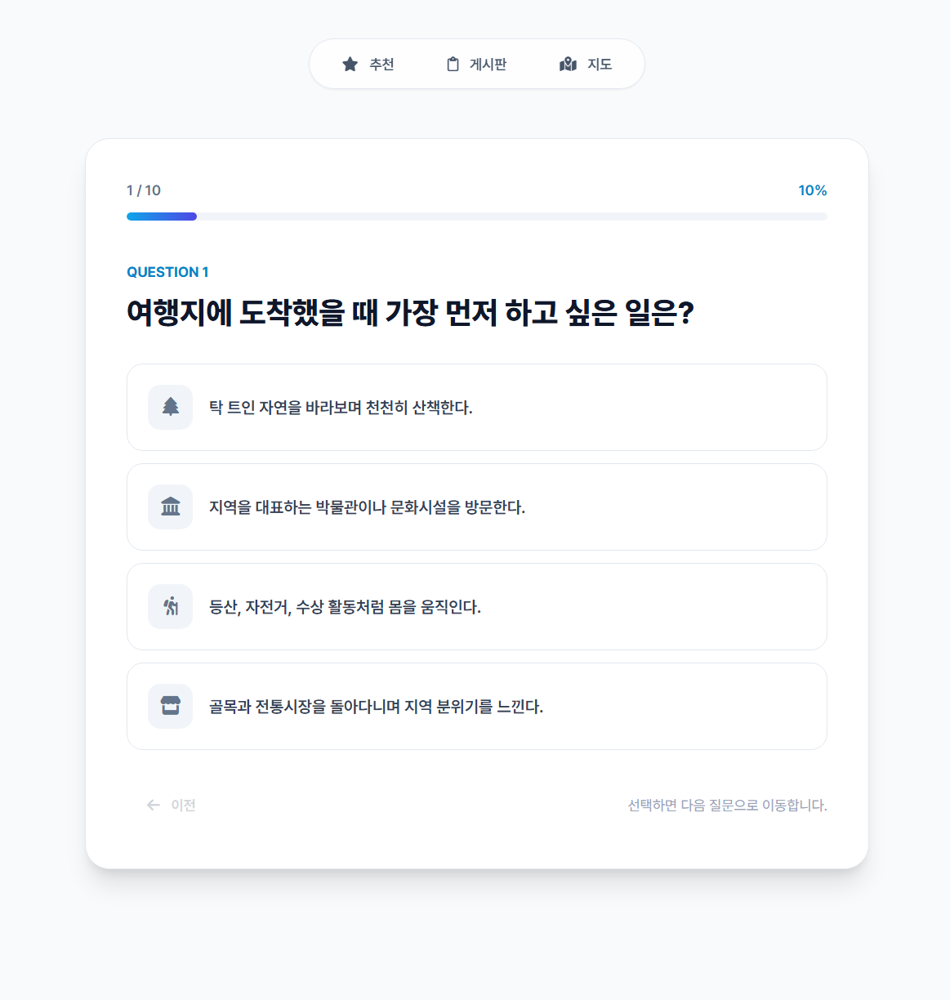
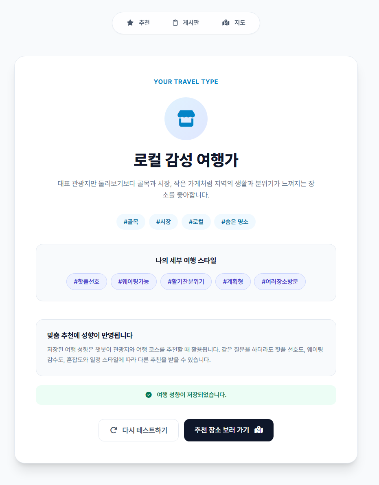
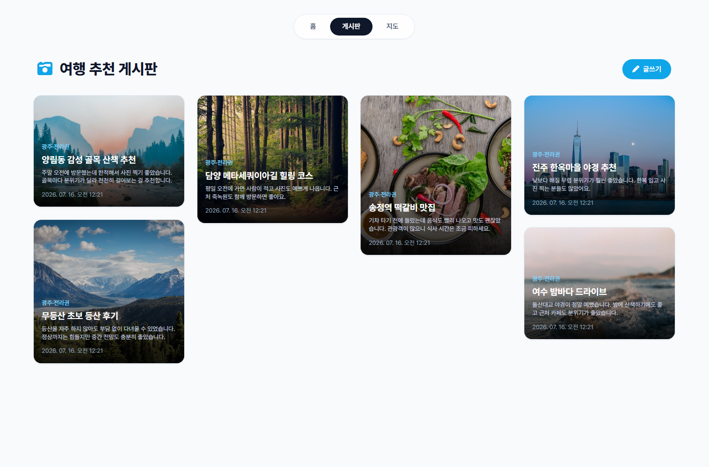
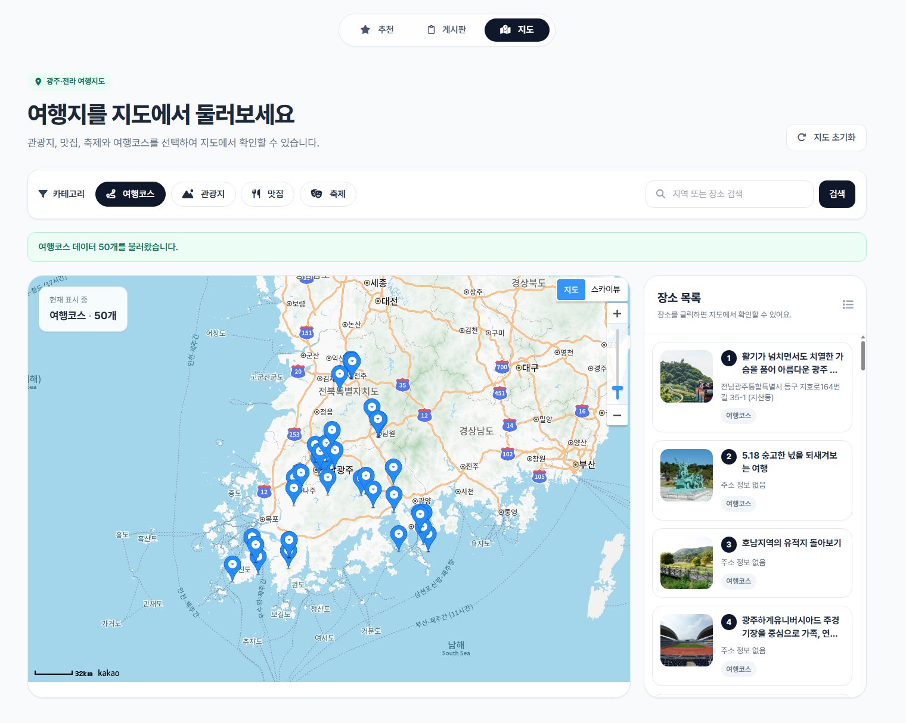
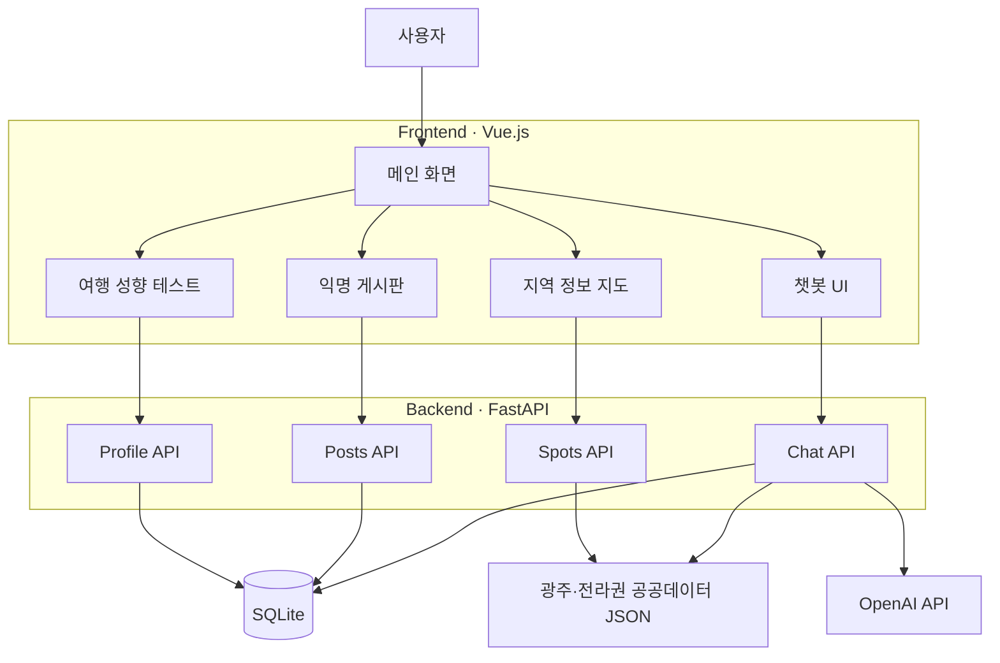

# team_triple_H_project
Start Camp 바이브 코딩 팀 프로젝트 레포지토리

<div align="center">

# 🧭 여정

### 당신의 취향이 목적지가 되는 순간

**여행 성향 테스트 · 공공데이터 · 익명 커뮤니티를 결합한  
광주·전라권 맞춤형 여행 추천 서비스**

<br />


<br />

> **사용자가 여행지를 검색하기 전에,  
> 사용자의 여행 방식을 먼저 이해합니다.**

</div>

---

## 📌 프로젝트 소개

대부분의 여행 추천 서비스는 사용자가 입력한 지역이나 키워드를 기준으로 비슷한 장소를 추천합니다.

**여정**은 사용자가 여행에서 무엇을 좋아하고 무엇을 불편해하는지 먼저 분석합니다.

- 유명한 핫플을 선호하는가?
- 긴 웨이팅을 감수할 수 있는가?
- 활기찬 장소와 한적한 장소 중 어디를 좋아하는가?
- 계획적인 여행과 즉흥적인 여행 중 어느 쪽에 가까운가?
- 여러 장소를 빠르게 둘러보는가, 한 장소에 오래 머무는가?

여행 성향 테스트 결과는 익명 사용자별 프로필로 SQLite에 저장됩니다.  
이 프로필은 이후 챗봇이 관광지와 여행 코스를 추천할 때 활용됩니다.

### 같은 질문, 다른 추천

```text
사용자 A
#핫플선호 #웨이팅가능 #활기찬분위기
→ 대표 관광지, 인기 맛집, 축제 중심 추천

사용자 B
#숨은명소선호 #노웨이팅선호 #한적한분위기
→ 로컬 명소, 조용한 산책로, 혼잡도가 낮은 장소 중심 추천
```

---

## ✨ 핵심 기능

<table>
  <tr>
    <td align="center" width="33%">
      <h3>🧠 여행 성향 분석</h3>
      10개의 질문을 통해<br/>
      메인 여행 유형과<br/>
      세부 여행 성향을 분석합니다.
    </td>
    <td align="center" width="33%">
      <h3>🤖 맞춤형 챗봇</h3>
      여행 프로필과 지역 공공데이터를 활용해<br/>
      사용자 성향에 맞는<br/>
      여행지를 추천합니다.
    </td>
    <td align="center" width="33%">
      <h3>💬 익명 커뮤니티</h3>
      회원가입 없이 게시글을 작성하고<br/>
      작성 시 입력한 비밀번호로<br/>
      수정·삭제할 수 있습니다.
    </td>
  </tr>
</table>

---

## 🧠 여행 성향 테스트

### 메인 여행 유형

| 유형 | 설명 |
|---|---|
| 🌿 **자연 속 힐링 여행가** | 자연과 풍경을 감상하며 천천히 쉬는 여행을 선호합니다. |
| 🏛️ **도심 문화 탐방가** | 역사, 문화, 전시와 건축물을 살펴보는 여행을 선호합니다. |
| 🧗 **활동적인 모험 여행가** | 체험과 레포츠처럼 직접 움직이는 여행을 좋아합니다. |
| 🏘️ **로컬 감성 여행가** | 골목, 시장, 작은 가게처럼 지역의 일상을 경험하고 싶어 합니다. |

### 세부 여행 성향

```text
#핫플선호       ↔ #숨은명소선호
#웨이팅가능     ↔ #노웨이팅선호
#활기찬분위기   ↔ #한적한분위기
#계획형         ↔ #즉흥형
#여러장소방문   ↔ #한장소집중
```

### 성향 결과 저장 예시

```json
{
  "client_id": "38c1375c-9ec7-47d0-85fa-55c72aadf29a",
  "main_type": "local",
  "main_title": "로컬 감성 여행가",
  "traits": {
    "hotplace": -2,
    "waiting": -1,
    "crowd": -2,
    "planning": -1,
    "pace": -1
  },
  "tags": [
    "숨은명소선호",
    "노웨이팅선호",
    "한적한분위기",
    "즉흥형",
    "한장소집중"
  ]
}
```

---

## 🔄 서비스 이용 흐름



1. 사용자가 여행 성향 테스트를 진행합니다.
2. 메인 여행 유형과 세부 성향 점수를 계산합니다.
3. 브라우저별 익명 `client_id`를 생성합니다.
4. 성향 결과를 SQLite에 저장합니다.
5. 챗봇 질문 시 `client_id`를 함께 전달합니다.
6. 백엔드가 저장된 성향과 공공데이터를 바탕으로 추천을 생성합니다.

---

## 🖥️ 주요 화면

> 아래 이미지 파일을 추가하면 README에서 바로 표시됩니다.

```text
docs/images/
├── main.png
├── personality-test.png
├── personality-result.png
├── board.png
└── map.png
```

### 메인 화면



### 여행 성향 테스트



### 성향 분석 결과



### 익명 커뮤니티



### 지역 정보 지도



---

## 🛠️ 기술 스택

### Frontend

| 기술 | 사용 목적 |
|---|---|
| Vue.js 3 | SPA 화면 구성 |
| Vue Router | 화면 라우팅 |
| Axios | FastAPI 서버 통신 |
| Tailwind CSS | 반응형 UI 구성 |
| Font Awesome | 화면 아이콘 |

### Backend

| 기술 | 사용 목적 |
|---|---|
| FastAPI | REST API 서버 구축 |
| SQLAlchemy | ORM 및 데이터베이스 관리 |
| SQLite | 게시글 및 여행 성향 데이터 저장 |
| Pydantic | 요청·응답 데이터 검증 |
| OpenAI API | 지역 정보 챗봇 응답 생성 |

### Deployment

| 영역 | 서비스 |
|---|---|
| Frontend | Netlify |
| Backend | Render |
| Database | SQLite |

---

## 🏗️ 시스템 구조



---

## 📂 프로젝트 디렉토리 구조 (Directory Structure)

```text
project_dir/
├── .git/
├── .gitignore               # 프로젝트 전체 통합용 제외 설정
├── README.md                # 전체 프로젝트 개요 및 배포 URL 기재
│
├── backend/                 # [Backend] Render 배포 서비스 영역
│   ├── main.py              # FastAPI 진입점 (익명 CRUD, /api/chat 엔드포인트)
│   ├── database.py          # SQLAlchemy 연결 및 세션 설정
│   ├── models.py            # SQLite 테이블 스키마 (posts 등)
│   ├── schemas.py           # Pydantic 데이터 검증 모델
│   ├── local_info.json      # 한국관광공사 제공 원본 JSON 데이터
│   ├── lclsSystemCode.json  # 분류 체계 코드 매핑 JSON 파일
│   ├── .env                 # API 키, DB 경로 등 민감정보 (★Git 커밋 절대 금지)
│   ├── .gitignore           # backend 전용 제외 설정 (.env, .db, __pycache__)
│   ├── community.db         # 로컬 테스트용 SQLite 파일 (구동 시 자동 생성)
│   └── requirements.txt     # 백엔드 의존성 패키지 목록 (FastAPI, Uvicorn, OpenAI 등)
│
└── frontend/                # [Frontend] Netlify 배포 서비스 영역
    ├── index.html           # SPA 메인 HTML 마스터 파일
    ├── package.json         # 프론트엔드 의존성 패키지 목록 (Vue 3, Axios, Vite 등)
    ├── vite.config.js       # Vite 빌드 및 개발 서버 설정 파일
    ├── .env.production      # 프로덕션 배포 시 사용할 Render 백엔드 API 주소
    ├── .env.local           # 로컬 개발 시 사용할 백엔드 주소 (http://localhost:8000)
    ├── .gitignore           # frontend 전용 제외 설정 (node_modules, dist 등)
    ├── public/
    │   └── favicon.ico      # 브라우저 탭 아이콘
    └── src/
        ├── main.js          # Vue.js 애플리케이션 진입점
        ├── App.vue          # 최상위 루트 컴포넌트
        ├── assets/          # 글로벌 CSS 스타일 및 정적 자원
        ├── components/
        │   └── ChatBot.vue  # [필수] 챗봇 UI 컴포넌트 (플로팅, 히스토리 유지, 모바일 대응)
        └── views/           # [필수] 1개 권역 카테고리 게시판 화면 정의
            ├── PostList.vue # 게시글 목록 조회 화면
            ├── PostDetail.vue # 게시글 상세 조회 화면
            └── PostForm.vue   # 게시글 작성 및 수정 화면 (수정용 비밀번호 처리 포함)
```

---

## 🚀 로컬 실행 방법

### 1. 저장소 복제

```bash
git clone <REPOSITORY_URL>
cd triple_H_project
```

### 2. Python 가상환경 생성

```bash
python -m venv .venv
```

#### Windows Git Bash

```bash
source .venv/Scripts/activate
```

#### Windows PowerShell

```powershell
.\.venv\Scripts\Activate.ps1
```

### 3. 백엔드 패키지 설치

```bash
pip install -r backend/requirements.txt
```

### 4. 백엔드 환경변수 설정

`.env` 파일을 생성합니다.

```env
DATABASE_URL=sqlite:///./community.db
OPENAI_API_KEY=your_openai_api_key
```

> `.env` 파일은 Git 저장소에 올리지 않습니다.

### 5. FastAPI 실행

프로젝트 루트에서 실행합니다.

```bash
uvicorn backend.main:app --reload
```

API 문서:

```text
http://127.0.0.1:8000/docs
```

### 6. 프론트엔드 실행

새 터미널에서 실행합니다.

```bash
cd frontend
npm install
```

`frontend/.env` 파일을 생성합니다.

```env
VITE_API_BASE_URL=http://127.0.0.1:8000
```

개발 서버를 실행합니다.

```bash
npm run dev
```

접속 주소:

```text
http://localhost:5173
```

---

## 📡 주요 API

### 게시글 API

| Method | Endpoint | 기능 |
|---|---|---|
| `GET` | `/api/posts` | 게시글 목록 조회 |
| `GET` | `/api/posts/{post_id}` | 게시글 상세 조회 |
| `POST` | `/api/posts` | 게시글 작성 |
| `PUT` | `/api/posts/{post_id}` | 비밀번호 확인 후 게시글 수정 |
| `DELETE` | `/api/posts/{post_id}` | 비밀번호 확인 후 게시글 삭제 |

### 여행 성향 API

| Method | Endpoint | 기능 |
|---|---|---|
| `POST` | `/api/profiles` | 여행 성향 저장 또는 갱신 |
| `GET` | `/api/profiles/{client_id}` | 익명 사용자의 여행 성향 조회 |

### 지역 정보·챗봇 API

| Method | Endpoint | 기능 | 상태 |
|---|---|---|---|
| `GET` | `/api/spots` | 공공데이터 기반 관광지 조회 | 구현 |
| `POST` | `/api/chat` | 여행 성향 기반 챗봇 질의 | 구현 상태에 맞게 수정 |

---

## 🗃️ 데이터베이스

### `posts`

```text
id
category
title
content
password
image_url
created_at
modified_at
```

### `travel_profiles`

```text
id
client_id
main_type
main_title
hotplace_score
waiting_score
crowd_score
planning_score
pace_score
tags
created_at
modified_at
```

---

## 🔐 익명 사용자 처리 방식

별도의 회원가입과 로그인 기능은 사용하지 않습니다.

```text
브라우저 최초 테스트 완료
→ UUID 기반 client_id 생성
→ Local Storage에 client_id 저장
→ SQLite에 여행 성향 저장
→ 챗봇 요청 시 client_id 전달
```

`client_id`는 개인정보가 아니라 동일 브라우저에서 여행 성향을 다시 조회하기 위한 익명 식별자입니다.

게시글 수정과 삭제는 게시글 작성 시 입력한 비밀번호가 일치하는지 확인하여 처리합니다.

---

## 📊 활용 데이터

| 데이터 | 출처 | 활용 목적 | 라이선스 |
|---|---|---|---|
| 광주·전라권 관광지 데이터 | 제공 공공데이터 JSON | 관광지 조회 및 챗봇 추천 | 기능 명세서 기준으로 작성 |
| 커뮤니티 게시글 | 서비스 사용자 입력 | 여행 후기 및 지역 정보 공유 | 자체 생성 |
| 여행 성향 데이터 | 서비스 설문 결과 | 맞춤형 여행지 추천 | 자체 생성 |

> 추가 데이터를 사용하는 경우 출처, 수집일, 라이선스 및 공공누리 유형을 확인합니다.

---

## ✅ 개발 현황

| 기능 | 상태 |
|---|---|
| Vue 3 SPA 구조 | ✅ |
| 메인 화면 | ✅ |
| 여행 성향 테스트 | ✅ |
| 여행 성향 SQLite 저장·조회 | ✅ |
| 게시글 목록·상세 조회 | ✅ |
| 게시글 작성·수정·삭제 | ✅ |
| 공공데이터 관광지 조회 | ✅ |
| 지도 마커 시각화 | ✅ |
| 성향 기반 챗봇 | 🚧 |
| Netlify 배포 | ✅ |
| Render 배포 | ✅ |

---

## 🌐 배포 주소

| 서비스 | URL |
|---|---|
| Frontend | 배포 후 Netlify URL 작성 |
| Backend | 배포 후 Render URL 작성 |
| API Docs | Render 백엔드 URL 뒤 `/docs` |

---

## 👥 팀원 및 역할

| 이름 | 역할 | 담당 기능 |
|---|---|---|
| 팀원 1 | Frontend | 담당 기능 작성 |
| 한기헌 | Frontend / Backend | 여행 성향 테스트, 성향 저장 API, 맞춤 추천 프로필 |
| 팀원 3 | Backend | 담당 기능 작성 |
| 팀원 4 | AI / Data | 담당 기능 작성 |

---

## 🔮 향후 개선 방향

- 여행 성향과 공공데이터를 결합한 관광지 추천 점수 알고리즘
- 챗봇 답변에 핫플 선호도와 웨이팅 감수도 반영
- 추천 관광지 지도 마커 표시
- 게시글 검색 결과를 챗봇 답변에 활용
- 여행 성향 결과 공유 기능
- 추천 장소 북마크 기능
- 사용자 피드백을 활용한 추천 개선

---

<div align="center">

## 여행지를 찾는 것이 아니라,  
## 나에게 맞는 여행을 발견합니다.

### **여정**

</div>

